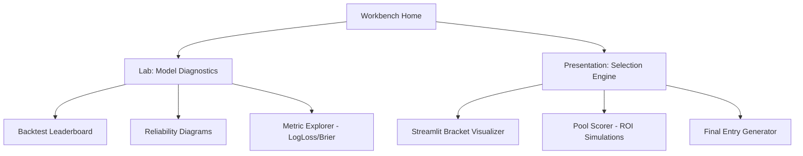

# UI/UX Specification: NCAA Tournament Data & Evaluation Platform

**Version:** 1.0
**Date:** 2026-02-13
**Author:** Sally (UX Expert)
**Status:** Approved

---

## 1. Introduction

This document defines the user experience goals, information architecture, user flows, and visual design specifications for the **NCAA Tournament Data & Evaluation Platform**. It serves as the foundation for frontend development, ensuring a cohesive experience optimized for a **single-user Data Science Workbench** built in Streamlit.

### 1.1 Overall UX Goals & Principles

* **Target User Persona**: **The Quantitative Strategist (Solo Data Scientist)**.
    * *Needs:* Low-latency access to model artifacts, comparison of high-dimensional results (Graph vs. Sequential), and "what-if" simulations for specific pool scoring rules.
* **Key Usability Goals**:
    * [cite_start]**Scientific Clarity**: Users must clearly identify model over-confidence through reliability diagrams.
    * **High Information Density**: Prioritize data tables, heatmaps, and diagnostic plots over whitespace.
    * **Configuration Fluidity**: Seamlessly adjust "Game Theory" weights (e.g., upset frequency vs. chalk) and see the immediate impact on bracket value.
* **Core Design Principles**:
    * **"No Black Boxes"**: Every data point in the UI must be traceable back to a source file or model version.
    * **Functional Minimalism**: Use Streamlit’s native components to maintain a clean, utility-first layout.

---

## 2. Information Architecture (IA)

The IA is designed for a non-linear workflow, allowing rapid movement between data ingestion, model diagnostics, and bracket generation.

### 2.1 Site Map

### 2.2 Navigation Structure

* Primary Navigation (Sidebar): A persistent Streamlit sidebar (st.sidebar) to switch between "Research Mode" (Lab) and "Entry Mode" (Presentation).
* Contextual Filters: Global selectors for Tournament Year, Model Version, and Scoring Format that persist across views to prevent context switching fatigue.
* Breadcrumb Strategy: Minimalist (e.g., Home > Lab > v1.2-GraphModel).

## 3. User Flows

### 3.1 Flow 1: The "Backtest-to-Selection" Diagnostic Loop

* **User Goal:** Review model performance metrics and visualize specific bracket outcomes before committing to a strategy.
* **Entry Point:** Lab Dashboard / Backtest Leaderboard.
* **Steps:**
    1.  **Filter & Sort**: User filters the **Backtest Leaderboard** by Year (e.g., 2024) and sorts by **Brier Score** or **LogLoss** to identify top-performing models.
    2.  **Diagnose**: User clicks a specific model run ID. The system opens the **Reliability Diagram** side-panel to reveal calibration (over/under confidence).
    3.  **Visualize**: User clicks "Visualize Bracket". The system passes that model’s probability matrix into the **Streamlit Bracket Visualizer**.
    4.  **Refine**: User interactively toggles "Game Theory" sliders (e.g., *Increase Upset Weight*) to adjust the visualizer without altering the underlying model data.
    5.  **Selection**: User flags the specific configuration as a "Candidate Entry".

### 3.2 Flow 2: The "Pool-Specific ROI" Simulation

* **User Goal**: Tailor a model's output to the specific scoring rules of a target pool to maximize Expected Value (EV).
* **Entry Point**: Presentation Layer / Selection Engine.
* **Steps:**
    1.  **Configure Pool**: User inputs **Pool Scoring Rules** (e.g., "Seed-Difference Bonus", "Standard 1-2-4-8", or "Fibonacci").
    2.  **Simulate**: User clicks "Run ROI Sim". The system simulates the selected model against 10,000 generated "public" brackets based on historical pick rates.
    3.  **Analyze**: System displays a distribution graph of expected finishes (e.g., "Top 10% Probability: 15%").
    4.  **Export**: User clicks "Generate Submission" to export the **Final Entry File** (CSV/JSON) formatted for the specific pool.

---

## 4. Component Library & Visual Style

### 4.1 Core Components

* **Diagnostic Cards**:
    * *Type:* `st.metric` containers.
    * *Usage:* Display key performance deltas (e.g., "Brier Score: 0.18 (-0.02 vs baseline)").
* **The "Heatmap" Dataframe**:
    * *Type:* `st.dataframe` with Pandas styling.
    * *Usage:* Conditional formatting (Green-to-Red gradients) applied to LogLoss columns to instantly highlight model outliers.
* **Interactive Bracket Tree**:
    * *Type:* Custom Streamlit Component (D3.js or Mermaid.js wrapper).
    * *Interactivity:* Clickable nodes. Clicking a game node opens a modal showing "Tale of the Tape" features (KenPom eff, Graph Centrality, Head-to-Head).
* **Simulation Sliders**:
    * *Type:* `st.sidebar.slider`.
    * *Usage:* "Game Theory" inputs (Upset Aggression, Chalk Bias, Seed-Weight) used to perturb the model's base probabilities.

### 4.2 Branding & Style

* **Visual Identity**: **Dark Mode** enforced by default to reduce eye strain during long analysis sessions.
* **Color Palette**: Functional, data-centric colors only.
    * **Green (`#28a745`)**: Performance Improvement / High Confidence / Under-valued.
    * **Red (`#dc3545`)**: Performance Regression / Low Confidence / Over-valued.
    * **Neutral (`#6c757d`)**: Structural elements, borders, and standard text.
* **Typography**: Monospace fonts for all data tables and code snippets (e.g., `IBM Plex Mono` or system default monospace).

---

## 5. Responsiveness & Performance

### 5.1 Responsiveness Strategy

* **Target**: **Desktop Only (Wide Mode)**.
* **Layout Constraint**: The 64-team bracket visualization requires Streamlit's "Wide Mode" configuration (`layout="wide"`) to prevent horizontal scrolling and ensure all four regions are visible simultaneously.
* **Mobile**: Not supported. This is a desktop-only application.

### 5.2 Performance Considerations

* **Interaction Response**: Diagnostic plots and bracket updates must render in under **500ms** to maintain a "flow state" during research.
* **Caching Strategy**:
    * Heavily utilize `@st.cache_data` for historical datasets and model artifacts.
    * Switching "Tournament Year" filters should not trigger a full CSV re-parse from the file system.
* **Compute Offloading**: ROI Simulations (10k+ iterations) should run asynchronously or provide a progress bar (`st.progress`) to prevent UI freezing.
